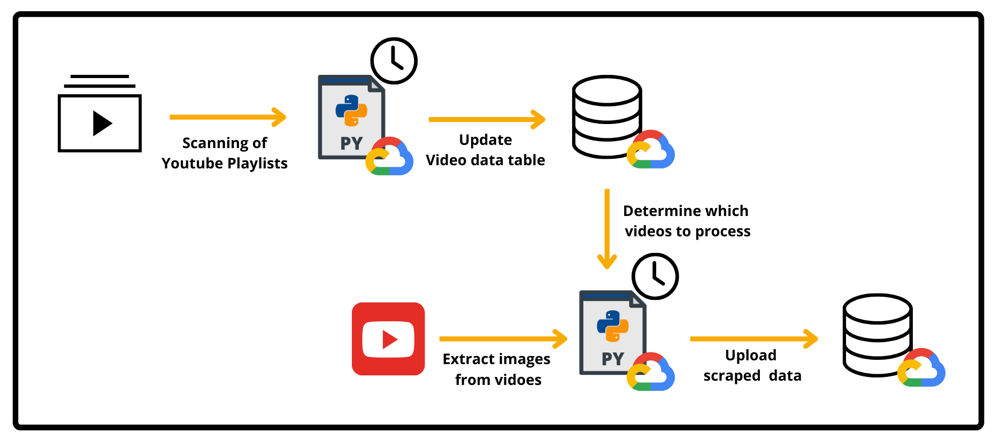
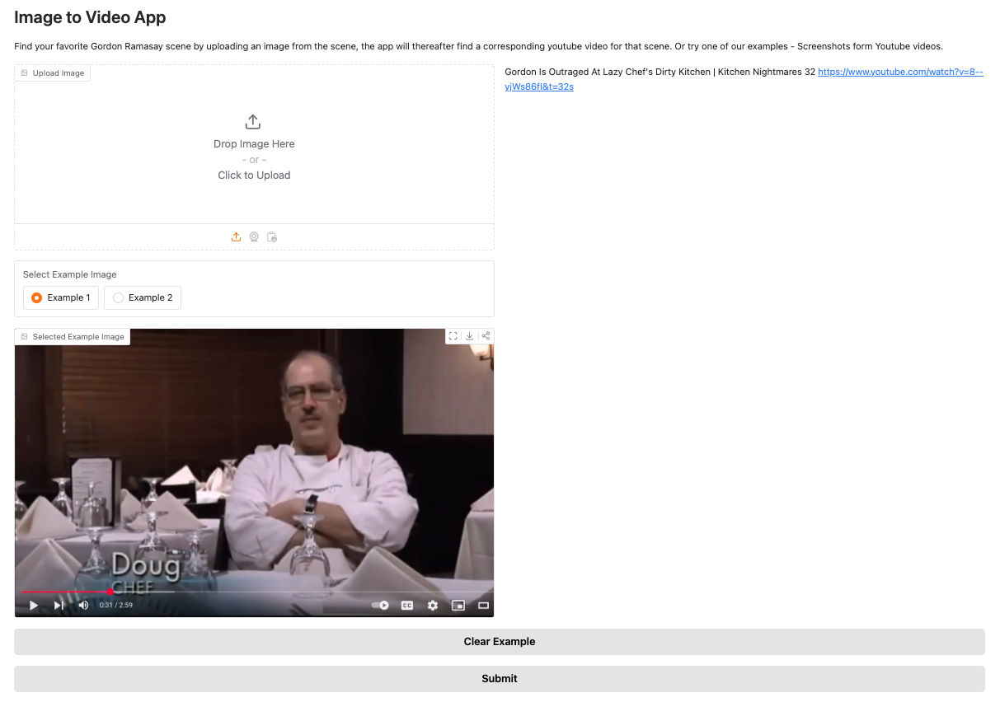

# Image to Youtube Video Project
This project is a complete ML system designed to help users identify the specific YouTube video and timestamp that correspond to their uploaded image. 
Our data consists of images scraped of various vides from Gordon Ramsay TV shows and the service is accessible [here.](https://huggingface.co/spaces/eybro/image_video_timestamp)

This project was done as the final project of the course **ID2223 - Scalable Machine Learning & Deep learning** at KTH.
# Overview

The system can be splitted into two parts:
* Data collection: Scheduled scraping of Youtube videos to extract images from each timestamp
* End-to-End Prediction System: Feature extraction, model building and inference.

## **Data Collection**

Firstly a few youtube playlist were chosen as a dataset to get a decent amount of data.
We went with three playlists from the youtube channel "Kithchen Nightmates" with
Gordon Ramsay.

The entire data collection pipeline was set up in google cloud, it consists of three cloud
functions and one database table.

The first function takes the playlist urls  and scrapes data from youtube about their contents
and inserts that data into a database table.

The second function goes through this table and downloads videos which are not alread
marked as processed, then splits the video into images at one second increments. The resulting
images are stored in a storage bucket on google cloud.

Lastly a script takes all the images and creates a labeled dataset which is uploaded to huggingface.

## **End-to-End Prediction System**

The prediction system uses the data collected by the Data Collection part and periodically uploads the images with the label and timestamps to a huggingface dataset. Thereafter the images are used to train a convolutional autoencoder model, which is then used to create vector embeddings of frames in the videos. Both the model and embeddings are thereafter pushed to huggingface, where they are accessed by the inference app consisting of a user firendly Gradio app. 

The Gradio app allows the user to upload their own image which is then encoded by the model and the closest neighbouring image is therafter found and the link to the corresponding Youtube video with a timestamp is presented to the user. 

# Explanation of Parts
### 1. Feature Pipeline
The Data collection architecture described in the section above is scheduled to run daily and add images as new videos are added to the playlists.

### 2. Training Pipeline

The training starts by  loading the dataset from hugggingface and splitting it into
train and test sets in a 80-20 split. The images are preprocessed by changing the resolution
to 64x64, making it a numpy array and normalizing its values.

Then the convolutional autoencoder model is constructed based on [this example](https://keras.io/examples/vision/autoencoder/)\
It consists of two parts: the encoder which deconstructs the image to a smaller dimension vector representation and the decoder which attempts 
to reconstruct the image from the same vector.
We then extract the layer which contains this representation for all images. These are uploaded to huggingface to use in inference.

To find the video and timestamp of an unseen image we do the same process and search for the 
nearest neighbour by Euclidean distance among our processed images. With that image we can get the video and 
timestamp from our dataset.
### 3. Inference through Gradio User Interface

The [Gradio App](https://huggingface.co/spaces/eybro/image_video_timestamp) utilizes the autoencoder model, encoded images as well as the dataset to allow users to find a Youtube video with a timestamp corresponding to their uploaded image. It can therefore be thought of as the projects inference pipeline. Here is how it works step-by-step:
1. The user uploads an image or chooses one of the example images.
2. The image is resized and normalized in the same way as in the training pipeline.
3. The autoencoder model is used to encode the image and create a vector representation of it.
4. The image's nearest neighbour is found by searching for the pre encoded image with the smallest euclidean distance to the encoded uplaoded image.
5. The video title, timestamp and direct url is presented to the user.

# How to Run
To use the service, simply navigate to [this huggingface space](https://huggingface.co/spaces/eybro/image_video_timestamp)

To run this project yourself:
1. Deploy the 3 functions in the cloud_functions folder to GCP
2. Create a storage_bucket which the images can be saved to 
3. Run the colab notebook for training the model
4. Clone and setup a huggingface space for inference

In all of these steps credentials and specific variable names may have to be changed.
