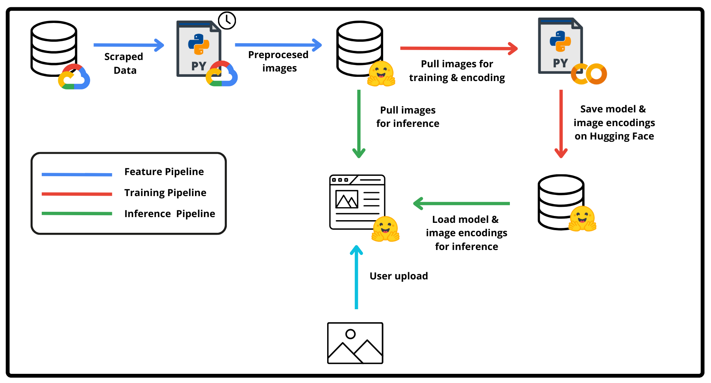

# Image to Youtube Video Project
This project is a complete ML system designed to help users identify the specific YouTube video and timestamp that correspond to their uploaded image. 
Our data consists of images scraped of various vides from Gordon Ramsay TV shows and the service is accessible [here.](https://huggingface.co/spaces/eybro/image_video_timestamp)

# Overview

The system can be splitted into two parts:
* Data collection: Scheduled scraping of Youtube videos to extract images from each timestamp
* End-to-End Prediction System: Feature extraction, model building and inference.

**Data Collection**

**End-to-End Prediction System**

